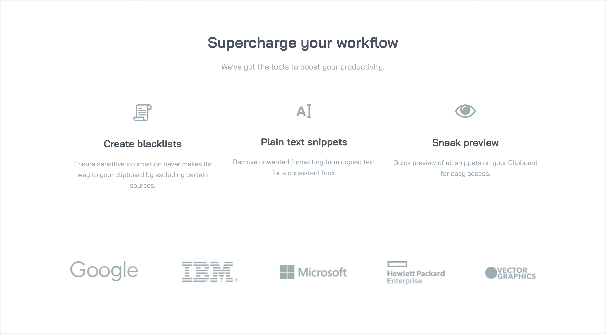
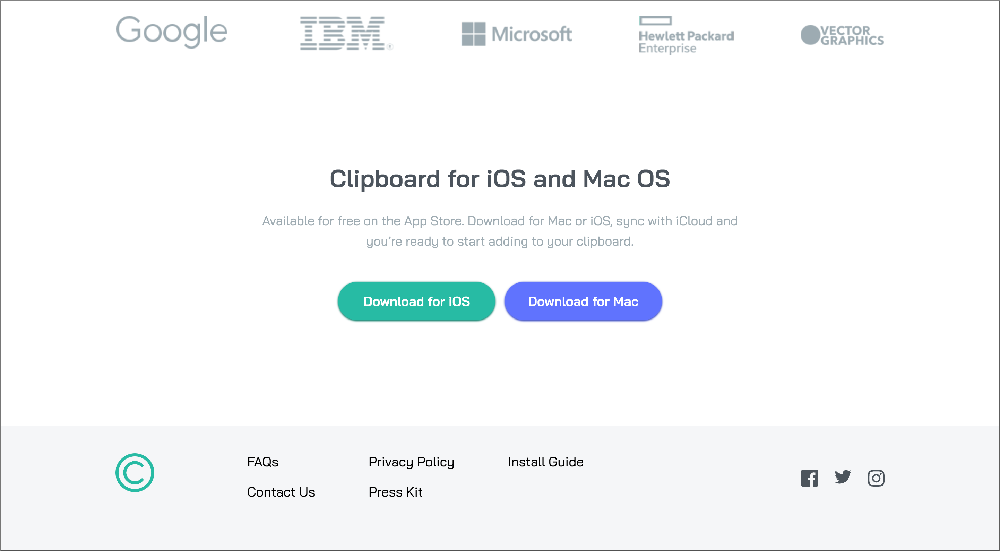
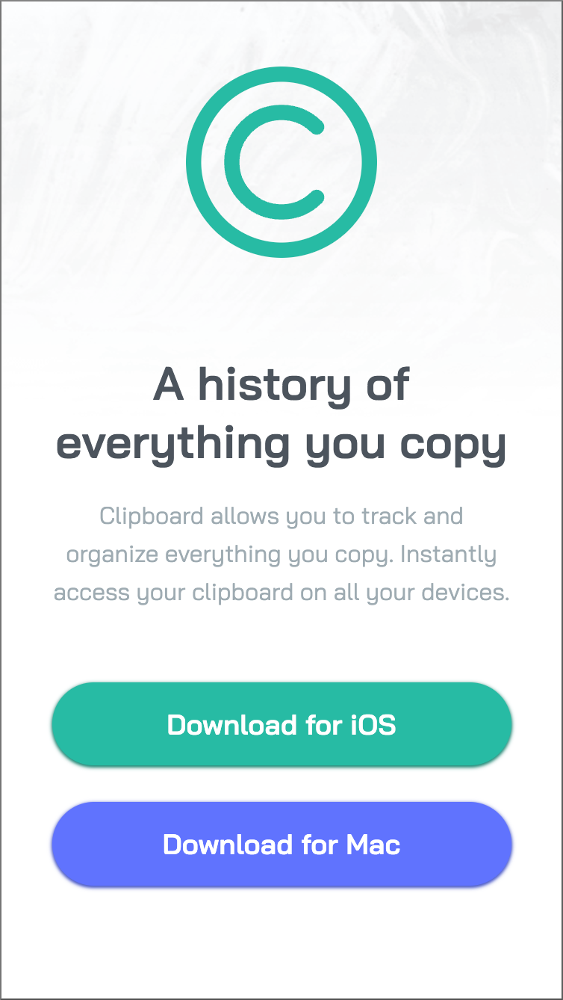
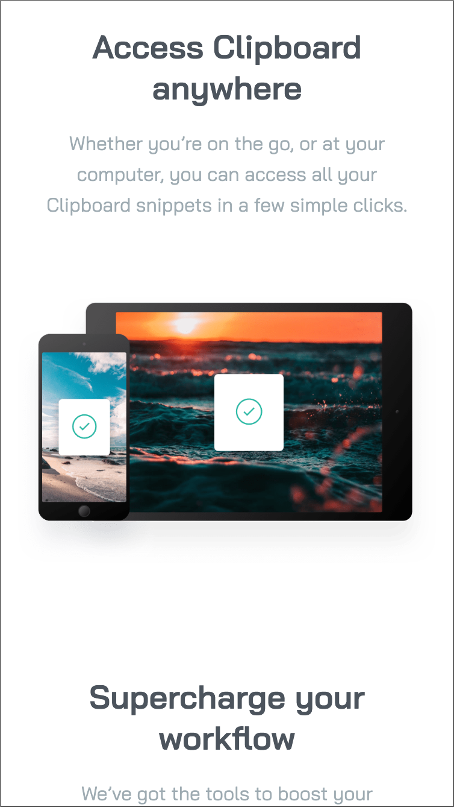

# Frontend Mentor - clipboard-landing-page

I coded this lading-page for a clipboard web-app myself and the layout was designed bij Frontend Mentor. Frontend Mentor provides challenges for frontend developers so they can make projects without the problem of designing the project. [See the challenge on Frontend Mentor.](https://www.frontendmentor.io/challenges/clipboard-landing-page-5cc9bccd6c4c91111378ecb9)

## The challenge

The challenge was to make a clipboard-landing-page as close to the design as possible. They provided a style-guide with the colors, font and screenshots of the design. Also a screenshot with active states was attached.

## Screenshots

  

## My experience

This time the buttons were a bit challenging. I hope they now look as close as possible to the design. It was hard to see how they were made out of a screenshot. Making the design also look well on other screens then desktop format had it's challenges and I learned a lot from it.

### Links

- Solution URL: [github repository](https://github.com/Jolijn0101/clipboard-landing-page)
- Live Site URL: [github page](https://jolijn0101.github.io/clipboard-landing-page/)
